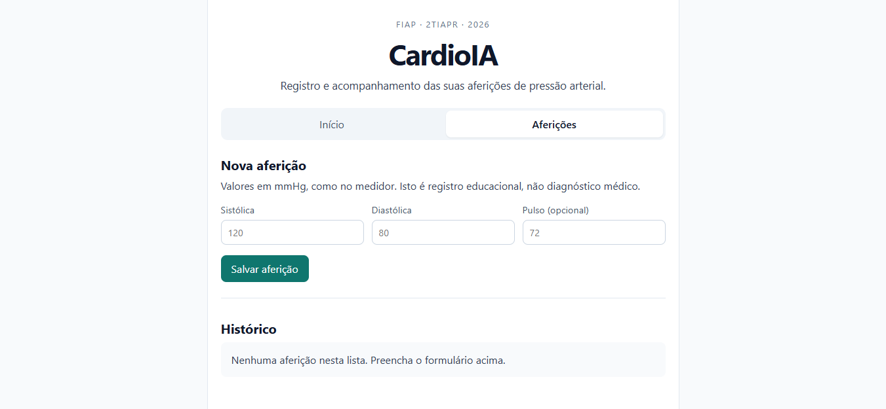

# CardioIA

Aplicação web desenvolvida em React para **registro e acompanhamento de aferições de pressão arterial**.

> Projeto educacional da FIAP · 2TIAPR · 2026



## Sobre o projeto

O **CardioIA** foi desenvolvido para organizar os registros de pressão arterial informados pelo próprio usuário.

Nesta etapa do projeto, o foco está no desenvolvimento da interface e no uso de conceitos fundamentais do React, como:

- Componentes
- Props
- Estado (`state`)
- Formulários
- Eventos
- Renderização de dados
- Navegação entre telas/seções

**Importante:** o projeto possui finalidade educacional e não substitui avaliação ou diagnóstico médico.

## Funcionalidades

- Página inicial de apresentação do sistema
- Cadastro de uma nova aferição
- Registro de:
  - Pressão sistólica
  - Pressão diastólica
  - Pulso (opcional)
- Exibição do histórico de aferições
- Interface simples e responsiva
- Organização da aplicação utilizando componentes React

## Interface

A aplicação possui duas áreas principais:

### Início

Apresenta o CardioIA e orienta o usuário a realizar uma nova aferição.

### Aferições

Permite preencher o formulário com os valores medidos e salvar a aferição para acompanhamento no histórico.

## Tecnologias

- React
- JavaScript
- HTML
- CSS
- Node.js / npm

## Como executar o projeto

### 1. Instale as dependências

Abra o terminal na pasta do projeto e execute:

```bash
npm install
```

### 2. Inicie o projeto

```bash
npm run dev
```

### 3. Acesse no navegador

Após executar o comando, o terminal exibirá o endereço local da aplicação, normalmente:

```text
http://localhost:5173/
```

Abra esse endereço no navegador.

## Estrutura esperada

A estrutura pode variar de acordo com a organização do projeto, mas uma aplicação React normalmente possui arquivos semelhantes a:

```text
CardioIA/
├── public/
├── src/
│   ├── components/
│   ├── App.jsx
│   └── main.jsx
├── CardioIA.JPG
├── package.json
└── README.md
```

## Objetivo acadêmico

O projeto tem como objetivo aplicar conhecimentos de desenvolvimento web com React, especialmente a criação de interfaces utilizando **componentes, props e gerenciamento de estado**.

## Projeto

**CardioIA — FIAP · 2TIAPR · 2026**
